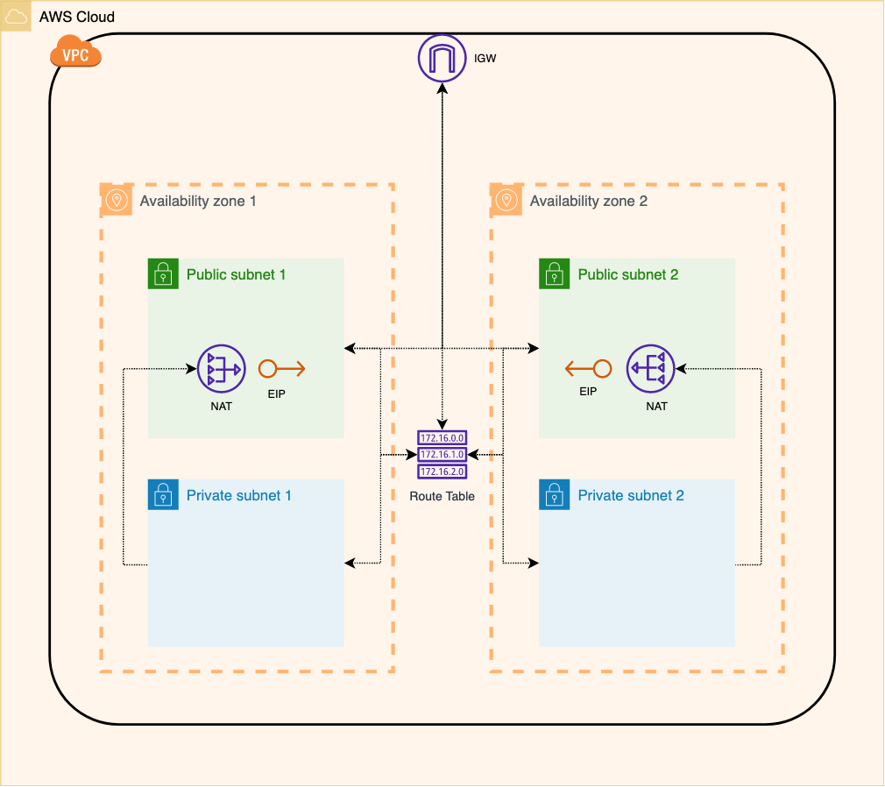

# AWS Terraform Standard Network Module

This Terraform module defines an AWS standard network setup, which is quite typical on most of the network infrastructures in AWS, containing:
- [VPC](https://docs.aws.amazon.com/vpc/latest/userguide/what-is-amazon-vpc.html)
- Public and Private [subnets](https://docs.aws.amazon.com/vpc/latest/userguide/VPC_Scenario2.html)
- [Internet Gateway](https://docs.aws.amazon.com/vpc/latest/userguide/VPC_Internet_Gateway.html)
- [NAT](https://docs.aws.amazon.com/vpc/latest/userguide/vpc-nat-gateway.html) and [Elastic IPs](https://docs.aws.amazon.com/AWSEC2/latest/UserGuide/elastic-ip-addresses-eip.html)
- [Route Tables](https://docs.aws.amazon.com/vpc/latest/userguide/VPC_Route_Tables.html) 

Bellow image, for simplicity only shows the network on two [availability zones](https://docs.aws.amazon.com/AWSEC2/latest/UserGuide/using-regions-availability-zones.html), but this module allows more based on configuration parameters.

Check the [example](example/README.md) for an End-To-End usage of the module.

**Contact:** [Leandro Mana](https://www.linkedin.com/in/leandro-mana-2854553b/)